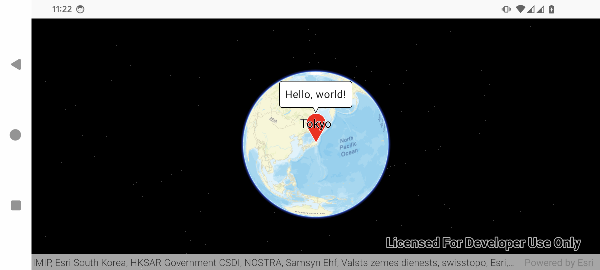
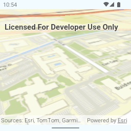
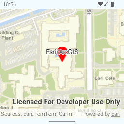
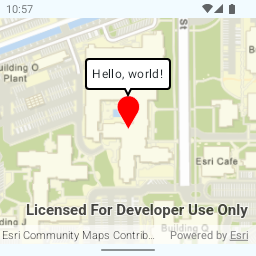
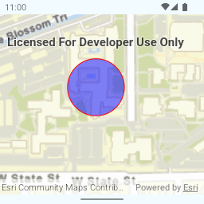
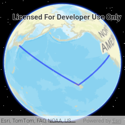
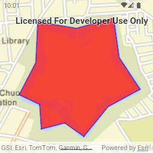
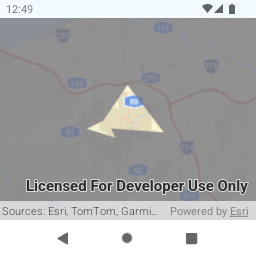
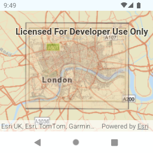

# ArcGIS SDK for MapConductor Android

## Description

MapConductor provides a unified API for Android Jetpack Compose.
You can use ArcGIS map view with Jetpack Compose, but you can also switch to other Maps SDKs (such as Mapbox, HERE, and so on), anytimes.

Even you use the wrapper API, but you can still access to the native ArcGIS view if you want.

## Setup

https://docs-android.mapconductor.com/setup/arcgis/

## Usage

```kotlin
@Composable
fun MapView(modifier: Modifier = Modifier) {
    var selectedMarker by remember { mutableStateOf<MarkerState?>(null) }

    val center = GeoPoint(
        latitude = 35.6762,
        longitude = 139.6503,
    )

    val mapViewState =
        rememberArcGISMapViewState(
            cameraPosition =
                MapCameraPosition(
                    position = center,
                    zoom = 2.0,
                ),
        )

    val markerState = remember { MarkerState(
            position = center,
            icon = DefaultMarkerIcon().copy(
                label = "Tokyo",
            ),
            onClick = {
                selectedMarker = it
            }
        )
    }

    ArcGISMapView(
        state = mapViewState,
        modifier = modifier,
    ) {
        Marker(markerState)

        selectedMarker?.let {
            InfoBubble(
                marker = it,
            ) {
                Text("Hello, world!")
            }
        }
    }
}
```




## Components

### ArcGISMapView [[docs]](https://docs-android.mapconductor.com/components/mapviewstate/)

```kotlin
@Composable
fun MapExample() {
    val initCameraPosition = MapCameraPosition(
        position = GeoPoint(34.057028, -117.196375),
        zoom = 18.0,
        tilt = 60.0,
        bearing = 30.0,
    )
    val mapViewState = rememberArcGISMapViewState(
        cameraPosition = initCameraPosition,
    )

    ArcGISMapView(
        state = mapViewState,
        modifier = modifier,
    )
}
```


------------------------------------------------------------------------

### Marker [[docs]](https://docs-android.mapconductor.com/components/marker/)

```kotlin
@Composable
fun MarkerExample() {
    val markerState = remember { MarkerState(
        position = GeoPoint(...),
        icon = DefaultMarkerIcon().copy(
            label = "Tokyo",
        ),
        onClick = {
            it.animate(MarkerAnimation.Bounce)
        },
    ) }

    ArcGISMapView(...) {
        Marker(markerState)
    }
}
```


------------------------------------------------------------------------

### InfoBubble [[docs]](https://docs-android.mapconductor.com/components/infobubble/)

```kotlin
@Composable
fun InfoBubbleExample() {
    var selectedMarker by remember { mutableStateOf<MarkerState?>(null) }

    val markerState = remember { MarkerState(
        ...,
        onClick = {
            selectedMarker = it
        },
    ) }

    ArcGISMapView(...) {
        Marker(markerState)
        selectedMarker?.let {
            InfoBubble(
                marker = it,
            ) {
                Text("Hello, world!")
            }
        }
    }
}
```


------------------------------------------------------------------------

### Circle [[docs]](https://docs-android.mapconductor.com/components/circle/)

```kotlin
@Composable
fun CircleExample() {

    val circleState = remember { CircleState(
        center = GeoPoint(...),
        radiusMeters = 50.0,
        fillColor = Color.Blue.copy(alpha = 0.5f),
        onClick = {
            it.state.fillColor = Color.Red.copy(alpha = 0.5f)
        }
    ) }

    ArcGISMapView(...) {
        Circle(circleState)
    }
}
```


------------------------------------------------------------------------

### Polyline [[docs]](https://docs-android.mapconductor.com/components/polyline/)

```kotlin
@Composable
fun PolylineExample() {

    val polylineState = remember { PolylineState(
            points = airports,
            strokeColor = Color.Blue.copy(alpha = 0.5f),
            geodesic = true,
        ) }

    ArcGISMapView(...) {
        Polyline(polylineState)
    }
}
```


------------------------------------------------------------------------

### Polygon [[docs]](https://docs-android.mapconductor.com/components/polygon/)

```kotlin
@Composable
fun PolygonExample() {

    val polygonState = remember { PolygonState(
        points = goryokaku,
        strokeColor = Color.Red.copy(alpha = 0.5f),
        fillColor =  Color.Red.copy(alpha = 0.7f),
    ) }

    ArcGISMapView(...) {
        Polygon(polygonState)
    }
}
```


------------------------------------------------------------------------

### Polygon Hole

```kotlin
@Composable
fun PolygonExample() {

    val polygonState =
        remember {
            PolygonState(
                points = listOf(...),
                holes = listOf(
                            listOf(...),
                            listOf(...),
                        ),
                fillColor = Color(0xCC787880),
                strokeColor = Color.Red,
                strokeWidth = 2.dp,
            )
        }

    ArcGISMapView(...) {
        Polygon(polygonState)
    }
}
```


------------------------------------------------------------------------
### GroundImage [[docs]](https://docs-android.mapconductor.com/components/groundimage/)

```kotlin
@Composable
fun GroundImageExample() {
    val groundImageState = remember { GroundImageState(
        bounds = GeoRectBounds(
            southWest = GeoPoint.fromLatLong(...),
            northEast = GeoPoint.fromLatLong(...),
        ),
        image = image,
        opacity = 0.5f,
    ) }

    ArcGISMapView(state = mapViewState) {
        GroundImage(groundImageState)
    }
}
```

